<!-- ============================================================================
        🐉🔥 THE CRIMSON FLAME SOVEREIGN
        RED DRAGON × GAME OF THRONES GITHUB PROFILE
============================================================================ -->

<div align="center">
  
</div>

<p align="center">
  
</p>

<div align="center">
  
</div>

---

## 🐉 THE DRAGON KING'S PROCLAMATION


```typescript
class CrimsonFlameSovereign {
  name: string = "Madhan Kumar P";
  title: string = "The Dragon King of Code";
  realm: string = "India";

  powers: string[] = [
    "AI Sorcery",
    "Full-Stack Warfare",
    "Dragon-Forged Code",
    "Cloud Kingdom Mastery"
  ];

  currentQuest(): void {
    console.log("⚔️ Forging PLANZO - AI Study Strategist");
    console.log("🔥 Building Story Seed Unleashed");
    console.log("🐉 Commanding an AI Dragon Army");
  }

  knowledge: string[] = [
    "Advanced AI & Machine Learning",
    "Angular Blade Combat",
    "MERN Realm Building",
    "Firebase Citadel Engineering"
  ];
}
```

<br clear="right"/>

---

## 🔥 CHAPTER I: THE RISE OF THE SOVEREIGN

<div align="center">
  
</div>

**In the age of mortal code and fragile machines,**
*when ordinary developers struggled with bugs and broken builds,*
**one warrior rose above all.**

🐉 **Born from fire. Forged in pressure.**
🔥 **Crowned in crimson embers.**
⚔️ **Ascended by dragons.**

> *"I am MADHAN KUMAR P — The Crimson Flame Sovereign."*

- 🔭 **Currently Forging**: PLANZO - AI Study Strategist
- 🌱 **Mastering**: Advanced AI, System Architecture, Cloud Sorcery
- 💬 **Ask me about**: AI Systems, Angular, MERN, Firebase, DevOps
- 📫 **Summon me**: madhanpdeveloper@gmail.com
- ⚡ **Draconic Truth**: *"I debug bugs with dragon fire"*

---

## 🛡️ ARSENAL OF THE FLAME SOVEREIGN

### ⚔️ Languages Forged in Dragon Fire
<p align="center">
  
</p>

### 🏰 Frameworks & Kingdoms
<p align="center">
  
</p>

### 🔮 Databases & Fortresses
<p align="center">
  
</p>

### ☁️ Cloud Realms & DevOps Magic
<p align="center">
  
</p>

### 🎨 Design & Enchantments
<p align="center">
  
</p>

---

## 🐉 CHAPTER II: THE DRAGON'S STATISTICS

<div align="center">
  
</div>

<div align="center">
  
  
</div>

<div align="center">
  
</div>

<div align="center">
  
</div>

---

## 📜 CHAPTER III: THE BATTLE TIMELINE

<div align="center">


</div>

---

## 🏆 LEGENDARY ACHIEVEMENTS

<div align="center">
  
</div>

### 🩸 AI Weapons Forged
- ⚔️ **PLANZO** - AI Study Strategist
- 🔥 **Story Seed Unleashed** - Creative AI Platform
- 🛡️ **Resume AI Forge** - Intelligent Resume Builder

### 🐉 Full-Stack Realms Built
- 🏰 **Event Kingdom Dashboard** - Real-time Management System
- 💰 **Finance Oracle** - AI-Powered Finance Tracker
- 🎯 **Task Realm Commander** - Advanced Project Management

### ⚔️ Dragons Slain (Problems Solved)
- 🐛 Memory Leak Dragons
- 🔴 API Demons of the Deep
- 🎨 CSS Layout Monsters
- ⚡ Performance Bottleneck Beasts
- 🔐 Security Vulnerability Serpents

---

## 🐍 THE RED SERPENT OF VALYRIA

<div align="center">
  <picture>
    <source media="(prefers-color-scheme: dark)" srcset="https://raw.githubusercontent.com/Platane/snk/output/github-contribution-grid-snake-dark.svg">
    <source media="(prefers-color-scheme: light)" srcset="https://raw.githubusercontent.com/Platane/snk/output/github-contribution-grid-snake.svg">
    
  </picture>
</div>

---

## 🔥 DRAGON ACTIVITY CHRONICLE

<div align="center">
  
</div>

---

## 🌐 PORTALS TO THE DRAGON'S KINGDOM

<div align="center">
  <a href="https://pmadhankumar.netlify.app">
    
  </a>
  <a href="https://linkedin.com/in/madhan-kumar-p">
    
  </a>
  <a href="mailto:madhanpdeveloper@gmail.com">
    
  </a>
  <a href="https://github.com/Madhan-Tech-AI">
    
  </a>
</div>

<div align="center">
  
</div>

---

## 💻 CODE CONTRIBUTIONS HEATMAP

<div align="center">
  
</div>

---

## 🎯 CURRENT BATTLES & QUESTS

<div align="center">

| 🗡️ Quest | ⚔️ Status | 🔥 Power Level |
|:---:|:---:|:---:|
| PLANZO AI Development | 🟢 In Progress | ████████░░ 80% |
| Story Seed Platform | 🟢 In Progress | ██████░░░░ 60% |
| AI Dragon Army | 🟡 Planning | ████░░░░░░ 40% |
| Cloud Kingdom Expansion | 🔴 Queued | ██░░░░░░░░ 20% |

</div>

---

## 🏰 KINGDOM ARCHITECTURE

```mermaid
graph TD
    A[🐉 The Crimson Flame Sovereign] --> B[⚔️ AI Sorcery]
    A --> C[🔥 Full-Stack Warfare]
    A --> D[☁️ Cloud Kingdoms]
    B --> E[Machine Learning]
    B --> F[Deep Learning]
    B --> G[NLP Magic]
    C --> H[Frontend Realm]
    C --> I[Backend Fortress]
    C --> J[Database Citadel]
    D --> K[AWS Empire]
    D --> L[Azure Territory]
    D --> M[GCP Domain]

    style A fill:#8B0000,stroke:#FF0000,stroke-width:4px,color:#fff
    style B fill:#DC143C,stroke:#FF0000,stroke-width:2px,color:#fff
    style C fill:#DC143C,stroke:#FF0000,stroke-width:2px,color:#fff
    style D fill:#DC143C,stroke:#FF0000,stroke-width:2px,color:#fff
```

<div align="center">



</div>

---

## 📚 GRIMOIRE OF KNOWLEDGE

<details>
<summary><b>🔮 AI & Machine Learning Spells</b></summary>
<br>

- 🧠 Neural Networks & Deep Learning
- 🎯 Computer Vision & Image Processing
- 💬 Natural Language Processing
- 🤖 LLM Integration & Fine-tuning
- 📊 Data Science & Analytics
- 🔍 Pattern Recognition Algorithms

</details>

<details>
<summary><b>⚔️ Frontend Battle Arts</b></summary>
<br>

- ⚛️ React.js & React Native Mastery
- 🅰️ Angular Blade Techniques
- 🎨 Tailwind CSS & Material Design
- 🔄 State Management (Redux, Context API)
- 📱 Responsive & Mobile-First Design
- ♿ Accessibility & Performance Optimization

</details>

<details>
<summary><b>🏰 Backend Fortress Building</b></summary>
<br>

- 🟢 Node.js & Express.js Architecture
- 🔥 RESTful API Construction
- ⚡ GraphQL Query Systems
- 🔐 Authentication & Authorization
- 🛡️ Security Best Practices
- 📦 Microservices Architecture

</details>

<details>
<summary><b>☁️ Cloud Kingdom Management</b></summary>
<br>

- ☁️ AWS Services (EC2, S3, Lambda)
- 🔷 Azure Cloud Solutions
- 🌩️ Google Cloud Platform
- 🐳 Docker Containerization
- ☸️ Kubernetes Orchestration
- 🚀 CI/CD Pipeline Automation

</details>

---

## 🎭 THE DRAGON KING'S ROLES

<div align="center">
  <table>
    <tr>
      <td align="center" width="300">
        <br />
        <b>🧙‍♂️ AI Warlock</b><br/>
        <i>Master of Algorithms</i>
      </td>
      <td align="center" width="300">
        <br />
        <b>🐉 Dragonborn Engineer</b><br/>
        <i>Full-Stack Architect</i>
      </td>
      <td align="center" width="300">
        <br />
        <b>⚔️ Code Spartan</b><br/>
        <i>Performance Warrior</i>
      </td>
    </tr>
  </table>
</div>

---

## 🔥 THE SOVEREIGN'S DECREE

<div align="center">
  

  <h3>
    <i>"Fire does not destroy the worthy.<br/>
    It reveals them."</i>
  </h3>

  <h3>
    <i>"I am the Crimson Flame Sovereign,<br/>
    and my code will burn through eternity."</i>
  </h3>

  
</div>

---

## 🎯 MANIFESTO OF THE DRAGON KING

> **I code not for glory, but for creation.**
> **I build not for fame, but for impact.**
> **I learn not for certificates, but for mastery.**
> **I lead not through authority, but through innovation.**

### 🔱 Core Principles

1. **🔥 Forge in Fire** - Every challenge strengthens my code
2. **🐉 Think Like a Dragon** - See systems from above, understand patterns deeply
3. **⚔️ Code Like a Warrior** - Clean, efficient, battle-tested
4. **🏰 Build Like a King** - Scalable, maintainable, legendary

---

## 📊 WEEKLY DEVELOPMENT BREAKDOWN

<div align="center">

<!--START_SECTION:waka-->
```text
TypeScript   12 hrs 30 mins  ███████████░░░░░░   55.2%
Python       5 hrs 15 mins   █████░░░░░░░░░░░░   23.1%
JavaScript   3 hrs 40 mins   ███░░░░░░░░░░░░░░   16.2%
CSS          1 hr 15 mins    █░░░░░░░░░░░░░░░░    5.5%
```
<!--END_SECTION:waka-->

</div>

---

## 🌟 FEATURED PROJECTS FROM THE KINGDOM

<div align="center">
  <a href="#">
    
  </a>
  <a href="#">
    
  </a>
</div>

---

## 💬 WORDS FROM FELLOW WARRIORS

<div align="center">
  
</div>

---

## 🎬 THE DRAGON'S JOURNEY CONTINUES...

<div align="center">
  
</div>

---

<div align="center">
  

  ### 🐉 The Crimson Flame Sovereign
  **"Forged in Fire. Crowned in Code. Eternal in Legacy."**

  
</div>

<!-- ============================================================================
      END OF THE CRIMSON FLAME SOVEREIGN'S CHRONICLE
============================================================================ -->
