<div align="center">

# 🐉 THE CRIMSON DRAGON SOVEREIGN 🐉


[](https://github.com/Madhan-Tech-AI)

</div>

---

<div align="center">
  
</div>

## 🔥 THE DRAGON'S POWER - TECH STACK

<div align="center">

### ⚔️ FRONTEND DOMINION


### 🏰 BACKEND FORTRESS


### 🐉 AI SORCERY & MACHINE LEARNING


### ☁️ CLOUD KINGDOMS


</div>

---

<div align="center">
  
</div>

## 📊 THE DRAGON'S BATTLE STATISTICS

<div align="center">


</div>

---

<div align="center">
  
</div>

## 🏆 LEGENDARY CONQUESTS & ACHIEVEMENTS

```mermaid
%%{init: {'theme':'dark', 'themeVariables': { 'primaryColor':'#DC143C', 'primaryTextColor':'#fff', 'primaryBorderColor':'#8B0000', 'lineColor':'#FF0000', 'secondaryColor':'#8B0000', 'tertiaryColor':'#0d1117'}}}%%
mindmap
  root((🐉 THE DRAGON))
    🔥 AI Mastery
      Machine Learning
      Deep Learning
      NLP & LLMs
      Computer Vision
    ⚔️ Full-Stack
      React Ecosystem
      Node.js Backend
      Database Design
      API Architecture
    ☁️ Cloud & DevOps
      AWS Services
      Docker & K8s
      CI/CD Pipelines
      Microservices
    🎯 Projects
      PLANZO AI
      Story Seed
      Finance Tracker
      Event Dashboard
```

<div align="center">



</div>

### 🩸 PROJECTS FORGED IN DRAGONFIRE

<div align="center">

| ⚔️ PROJECT | 🔥 DESCRIPTION | 🛡️ TECH STACK |
|:---:|:---|:---:|
| **PLANZO AI** | AI-powered study strategist that revolutionizes learning | `React` `Python` `OpenAI` `FastAPI` |
| **Story Seed** | Creative AI platform for infinite storytelling | `Next.js` `TypeScript` `LangChain` `Supabase` |
| **Resume Forge** | Intelligent resume builder with AI assistance | `React` `Node.js` `MongoDB` `OpenAI` |
| **Event Kingdom** | Real-time event management dashboard | `React` `Express` `PostgreSQL` `Socket.io` |
| **Finance Oracle** | AI-powered financial tracking and insights | `Next.js` `Python` `TensorFlow` `Charts.js` |
| **Task Commander** | Advanced project management system | `React` `Node.js` `MongoDB` `Redis` |

</div>

---

<div align="center">
  
</div>

## 🐲 THE RED SERPENT'S ACTIVITY

<div align="center">
  <picture>
    <source media="(prefers-color-scheme: dark)" srcset="https://raw.githubusercontent.com/Platane/snk/output/github-contribution-grid-snake-dark.svg">
    <source media="(prefers-color-scheme: light)" srcset="https://raw.githubusercontent.com/Platane/snk/output/github-contribution-grid-snake.svg">
    
  </picture>
</div>

---

## 🗡️ CURRENT QUESTS & BATTLES

<div align="center">


</div>

---

<div align="center">
  
</div>

## 🔱 THE SOVEREIGN'S PHILOSOPHY

<div align="center">

```typescript
class CrimsonDragonSovereign {
  private readonly creed = {
    mission: "Transform ideas into legendary digital kingdoms",
    vision: "Lead the AI revolution with fire and innovation",
    values: ["Excellence", "Innovation", "Impact", "Mastery"]
  };

  public manifest(): void {
    console.log("🐉 I code not for glory, but for creation");
    console.log("🔥 I build not for fame, but for impact");
    console.log("⚔️ I learn not for certificates, but for mastery");
    console.log("👑 I lead not through authority, but through innovation");
  }

  public decree(): string {
    return `
      ╔══════════════════════════════════════════════════╗
      ║  "FIRE DOES NOT DESTROY THE WORTHY.             ║
      ║   IT REVEALS THEM."                             ║
      ║                                                  ║
      ║  - THE CRIMSON FLAME SOVEREIGN                  ║
      ╚══════════════════════════════════════════════════╝
    `;
  }
}
```

</div>

---

## 🎯 DRAGON'S TIMELINE OF POWER

<div align="center">


</div>

---

<div align="center">
  
</div>

## 🌐 PORTALS TO THE DRAGON'S REALM

<div align="center">

[](https://pmadhankumar.netlify.app)
[](https://linkedin.com/in/madhan-kumar-p)
[](mailto:madhanpdeveloper@gmail.com)
[](https://github.com/Madhan-Tech-AI)
[](https://twitter.com/yourhandle)

</div>

---

## 📜 THE DRAGON'S GRIMOIRE

<details>
<summary><b>🔮 AI & MACHINE LEARNING SPELLS</b></summary>
<br>

```python
dragon_ai_powers = {
    "neural_networks": ["Deep Learning", "CNNs", "RNNs", "Transformers"],
    "nlp_magic": ["GPT Models", "BERT", "LangChain", "Prompt Engineering"],
    "computer_vision": ["Image Classification", "Object Detection", "Segmentation"],
    "ml_frameworks": ["TensorFlow", "PyTorch", "Scikit-learn", "Keras"],
    "llm_mastery": ["OpenAI API", "Anthropic Claude", "Fine-tuning", "RAG"]
}
```

</details>

<details>
<summary><b>⚔️ FRONTEND BATTLE TECHNIQUES</b></summary>
<br>

```javascript
const frontendArsenal = {
  frameworks: ["React", "Next.js", "Vue.js", "Angular"],
  styling: ["Tailwind CSS", "Styled Components", "Material-UI", "Framer Motion"],
  state: ["Redux Toolkit", "Zustand", "React Query", "Context API"],
  typescript: ["Advanced Types", "Generics", "Decorators", "Type Guards"],
  performance: ["Code Splitting", "Lazy Loading", "Memoization", "Web Vitals"]
};
```

</details>

<details>
<summary><b>🏰 BACKEND FORTRESS ARCHITECTURE</b></summary>
<br>

```javascript
const backendDomain = {
  runtime: ["Node.js", "Deno", "Bun"],
  frameworks: ["Express", "Fastify", "NestJS", "Hono"],
  databases: ["PostgreSQL", "MongoDB", "Redis", "Supabase"],
  api_design: ["REST", "GraphQL", "tRPC", "WebSocket"],
  security: ["JWT", "OAuth", "Encryption", "Rate Limiting"],
  testing: ["Jest", "Vitest", "Supertest", "Playwright"]
};
```

</details>

<details>
<summary><b>☁️ CLOUD KINGDOM DOMINION</b></summary>
<br>

```yaml
cloud_empire:
  aws:
    - EC2 & Auto Scaling
    - S3 & CloudFront
    - Lambda & API Gateway
    - RDS & DynamoDB
  containers:
    - Docker Mastery
    - Kubernetes Orchestration
    - Docker Compose
  cicd:
    - GitHub Actions
    - Jenkins
    - ArgoCD
  monitoring:
    - CloudWatch
    - Prometheus
    - Grafana
```

</details>

---

<div align="center">
  
</div>

## 🏅 BADGES OF HONOR

<div align="center">


</div>

---

## 💻 WEEKLY FORGE ACTIVITY

<div align="center">

<!--START_SECTION:waka-->
```text
TypeScript   ████████████░░░░░  55.2%   🔥 Dragon's Tongue
Python       █████░░░░░░░░░░░░  23.1%   🐍 Serpent's Wisdom
JavaScript   ███░░░░░░░░░░░░░░  16.2%   ⚡ Lightning Magic
CSS/SCSS     █░░░░░░░░░░░░░░░░   5.5%   🎨 Aesthetic Sorcery
```
<!--END_SECTION:waka-->

</div>

---

<div align="center">
  
</div>

## 🎭 THE THREE FORMS OF THE DRAGON

<div align="center">
  <table>
    <tr>
      <td align="center" width="33%">
        <br />
        <b>🧙‍♂️ THE AI WARLOCK</b><br/>
        <sub>Master of Machine Learning</sub><br/>
        <sub>Wielder of Neural Networks</sub>
      </td>
      <td align="center" width="33%">
        <br />
        <b>🐉 THE CODE DRAGON</b><br/>
        <sub>Full-Stack Architect</sub><br/>
        <sub>Builder of Digital Realms</sub>
      </td>
      <td align="center" width="33%">
        <br />
        <b>⚔️ THE CLOUD WARRIOR</b><br/>
        <sub>DevOps Commander</sub><br/>
        <sub>Scaler of Kingdoms</sub>
      </td>
    </tr>
  </table>
</div>

---

## 🌟 DRAGONS SLAIN (PROBLEMS SOLVED)

<div align="center">

| 🐲 DRAGON TYPE | ⚔️ BATTLES WON | 🏆 DIFFICULTY |
|:---|:---:|:---:|
| 🐛 Memory Leak Dragons | 247 | ⭐⭐⭐⭐ |
| 🔴 API Demons | 189 | ⭐⭐⭐⭐⭐ |
| 🎨 CSS Layout Beasts | 356 | ⭐⭐⭐ |
| ⚡ Performance Bottlenecks | 178 | ⭐⭐⭐⭐ |
| 🔐 Security Vulnerabilities | 92 | ⭐⭐⭐⭐⭐ |
| 🌐 Cross-Browser Chimeras | 134 | ⭐⭐⭐ |
| 📱 Responsive Design Hydras | 223 | ⭐⭐⭐⭐ |

</div>

---

<div align="center">
  
</div>

## 🔮 PROPHECY & VISION

<div align="center">

### 🎯 2024 Conquest Plans

```mermaid
%%{init: {'theme':'dark', 'themeVariables': { 'primaryColor':'#DC143C'}}}%%
graph LR
    A[🐉 Dragon King] --> B[🤖 AI Revolution]
    A --> C[☁️ Cloud Empire]
    A --> D[📱 Mobile Kingdom]
    B --> E[Advanced LLMs]
    B --> F[AI Agents]
    C --> G[Kubernetes Mastery]
    C --> H[Serverless Architecture]
    D --> I[React Native Apps]
    D --> J[Cross-Platform Tools]

    style A fill:#8B0000,stroke:#DC143C,stroke-width:4px,color:#fff
    style B fill:#DC143C,stroke:#FF0000,stroke-width:2px
    style C fill:#DC143C,stroke:#FF0000,stroke-width:2px
    style D fill:#DC143C,stroke:#FF0000,stroke-width:2px
```



</div>

---

## 💬 WORDS OF WISDOM FROM THE DRAGON

<div align="center">

### 📖 The Dragon's Decree

```
╔════════════════════════════════════════════════════════════╗
║                                                            ║
║  "In the forge of adversity, legends are born.           ║
║   In the flames of challenge, dragons rise.               ║
║   In the heat of battle, code becomes art.                ║
║   In the crucible of innovation, futures are forged."     ║
║                                                            ║
║                    - Crimson Flame Sovereign               ║
║                                                            ║
╚════════════════════════════════════════════════════════════╝
```


</div>

---

## 🎪 THE DRAGON'S SHOWCASE

<div align="center">

### 🌟 Featured Repositories

<a href="https://github.com/Madhan-Tech-AI/planzo-ai">
  
</a>
<a href="https://github.com/Madhan-Tech-AI/story-seed">
  
</a>

</div>

---

<div align="center">
  
</div>

## 🤝 SUMMON THE DRAGON

<div align="center">

### 💌 Open for Epic Collaborations

I forge alliances with fellow warriors and visionaries who share the passion for innovation and excellence.

**Seeking:**
- 🔥 AI/ML Research & Development
- ⚔️ Full-Stack Engineering Projects
- 🏰 Startup Technical Leadership
- 🐉 Open Source Contributions
- 🎯 Mentorship & Knowledge Sharing

**My Arsenal Includes:**
- AI-powered web applications
- Scalable cloud architectures
- Real-time systems & dashboards
- Machine learning integrations
- Technical consulting & code reviews

### 📨 Send a Raven

<a href="mailto:madhanpdeveloper@gmail.com">
  
</a>
<a href="https://linkedin.com/in/madhan-kumar-p">
  
</a>

</div>

---

## 📊 CONTRIBUTION HEATMAP

<div align="center">
  
</div>

---

<div align="center">
  
</div>

## 🎬 THE SAGA CONTINUES...

<div align="center">

### 🔥 The Fire Never Dies

```typescript
while (true) {
  learn();
  code();
  build();
  innovate();
  inspire();
  // The dragon's flame burns eternal
}
```


### 👑 THE CRIMSON FLAME SOVEREIGN

**"FORGED IN FIRE. CROWNED IN CODE. ETERNAL IN LEGACY."**


---


### ⭐ If the dragon impressed you, leave a star to fuel the eternal flame! ⭐

</div>

<div align="center">
  
</div>

---

<div align="center">
  <sub>Built with 🔥 by The Crimson Flame Sovereign | © 2024 Madhan Kumar P</sub>
</div>
